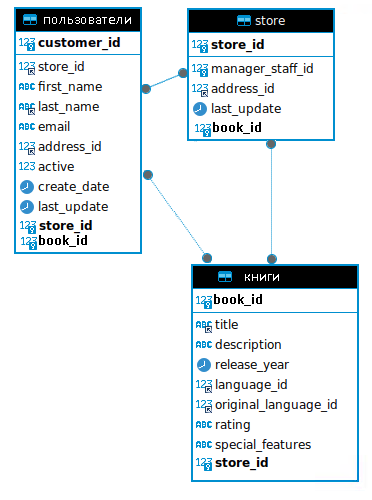
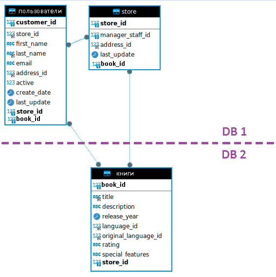
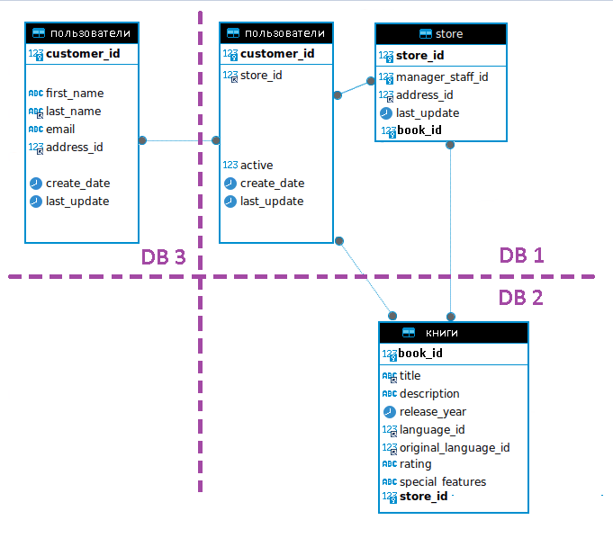

# Домашнее задание к занятию «Репликация и масштабирование. Часть 2» - Михалёв Сергей

### Задание 1

Опишите основные преимущества использования масштабирования методами:

- активный master-сервер и пассивный репликационный slave-сервер; 
- master-сервер и несколько slave-серверов;
- активный сервер со специальным механизмом репликации — distributed replicated block device (DRBD);
- SAN-кластер.

*Дайте ответ в свободной форме.*

**Решение**

#### - *активный master-сервер и пассивный репликационный slave-сервер;*
Просто вариант репликацци. Призван снизить нагрузку на мастера. Так же считается боле надёжным, так как в случае сбоя мастера, данные останутся на слейве. При этом слейв может стать мастером.
#### - *master-сервер и несколько slave-серверов;*
Более продвинутый вариант предыдущего метода. Отличается лучшим (на несколько слейвов) распределением нагрузки и устойчивостью к сбоям.
#### - *активный сервер со специальным механизмом репликации — distributed replicated block device (DRBD);*
[DRBD](https://en.wikipedia.org/wiki/Distributed_Replicated_Block_Device)- «распределённое реплицируемое блочное устройство» -програмный аналог RAID для облачных устроств. Мегапробвинутая технология дублирования БД, увеличивающаяй как устойчивость системы, сниженеи нагрузки на одельный сервер. Поддерживает как синхронную, так и асинхронную репликацию.

#### - *SAN-кластер.*

[High-Availability cluster, HA cluster](https://en.wikipedia.org/wiki/High-availability_cluster)- «кластер высокой доступности»- объединение нескольких серверов в сеть с целью увеличения производительности и/или надежности. Так же можно назвать высокопроизводительным продожением вышеупомянутых методов.

---

### Задание 2

Разработайте план для выполнения горизонтального и вертикального шаринга базы данных. База данных состоит из трёх таблиц: 

- пользователи, 
- книги, 
- магазины (столбцы произвольно). 

Опишите принципы построения системы и их разграничение или разбивку между базами данных.

*Пришлите блоксхему, где и что будет располагаться. Опишите, в каких режимах будут работать сервера.* 

**Решение**
Так как целью домашнего задания свляется освоение процесса шарлинга, а не постороения базы диннах с отношениями "многие ко многим", то простейшая блок-схема выглядит так

Для вертикального шардинга можно перенести в другую базу таблицу "книги", по количеству записей она может конкурировать только м таблицей "пользователи"

Для горизонтального шардинга можно вынести песональные данные пользователя в другую базу 

---
